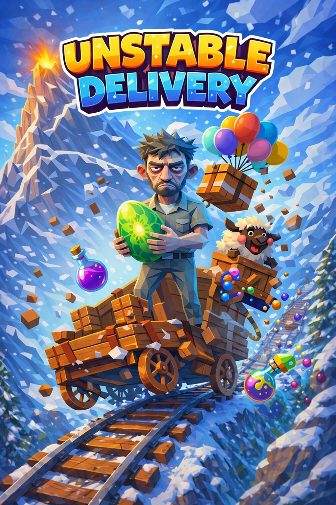

# 📦 Unstable Delivery

*A low-poly, fully physics-driven delivery disaster on a fantasy mountain.*



You are a mountain courier with terrible luck and worse cargo. Grab a package
at the base-camp depot, haul it up an increasingly hostile mountain — on foot,
by bounce mushroom, geyser, elevator platform, or cable car — drop it at the
glowing beacon, then get back down and collect the next, even worse one.

Everything is simulated: packages hang off your hands on a real spring, wind
shoves you, boulders roll, gondolas actually carry you, and the sheep never
agreed to any of this.

## Run it

```bash
npm install
npm run dev        # open the printed URL
```

Production build: `npm run build` (output in `dist/`, servable from any static host).

## Controls

| Input | Action |
|---|---|
| **WASD** | Move (camera-relative) |
| **Shift** | Sprint |
| **Space** | Jump — **hold in mid-air** to deploy the parcel-parachute, **tap just before a hard landing** to recovery-roll |
| **F** / right-click | Throw the top parcel (yeet-to-deliver counts!) — or kick whatever is in front of you |
| **G** | Set the top parcel down gently (seesaws, crate stacks) |
| **C** | Belly slide (hold while moving) — steerable toboggan, glorious downhill |
| **Mouse** | Camera (click the window to lock the pointer) |
| **Wheel** | Camera zoom |
| **M** | Music on/off |
| **P** | Photo mode (hide the HUD) |
| **Esc** | Pause |

## Getting paid

Clean deliveries (≥90 % condition) build an **On-a-Roll chain** — up to ×3 on
everything. Grazing boulders pays **close-call bonuses**, carrying through a
storm accrues **hazard pay**, delivering airborne (parachute, fresh mushroom
launch, or a well-aimed throw) stamps the parcel **AIRMAIL +75**, and chained
mushroom bounces pay **BOING combos**. After the cargo ladder is exhausted,
watch for the depot preview glowing gold: **golden packages** pay ×3 — and
cost 300 if you destroy them. Break the sheep's crate and she *escapes*;
catch her before she resigns.

Walk into the glowing ring at the depot to pick up a consignment. Walk into a
dropped one to pick it back up. Carry it into the beacon to deliver.

You can carry **up to three at once**. They hang in a vertical spring chain,
the bottom one is the one being routed, and you may only take as many as you
have destinations left on the manifest. An anvil dispatches alone.

Arrive under **25 % condition** and the recipient refuses to sign: the parcel
stays in your hands, the beacon moves to the depot, and you carry it back
down. It is the only thing in the game that ever asks you to descend.

## The cargo escalation ladder

1. **Plain Crate** — suspiciously unremarkable
2. **Grandma's Porcelain** — fragile; every impact is remembered
3. **Balloon Bundle** — near-weightless; the wind has opinions
4. **Dragon Egg** — periodically leaps; hates being carried
5. **Sheep in a Crate** — kicks harder the faster you run
6. **Cursed Anvil** — 45 kg; you will be taking the cable car
7. **Unstable Potion** — watch the instability meter; do not shake
8. **Ghost Package** — occasionally forgets which way is down

Deliveries pay by altitude, condition and speed. Destroyed packages come out
of your pay, and a replacement is waiting at the depot.

## Shifts, quotas and requisitions

A shift is a **manifest** of consignments — three on your first, up to eight
later. It ends when the last line closes, and a line closes exactly twice:
DELIVERED or WRITTEN OFF. Time is a scoring axis, never a terminator.

Miss the quota and the shift still ends and still pays; you simply go on a
**performance plan**. Three consecutive plans and your route is reassigned to
shift one — but your Merit Points, requisitions and records all survive.

Merit Points buy **requisitions** between shifts: a load harness, steel-toed
boots, reinforced packaging, cargo insurance, a seniority bonus that raises the
chain cap, a company parachute, a hazard pay grade, a cable car annual pass, a
union rest break and a liability waiver. Merit Points are not currency and have
no cash value.

## Language and quality

The whole interface is **bilingual, switchable at runtime** (EN/DE, defaulting
from `navigator.language`) — including mid-delivery. German is rewritten
comedy, not a translation; the company addresses you formally while docking
your pay.

Three quality tiers auto-select from a p95 frametime window, with a manual
override in the pause menu. Pixel ratio, bloom, shadow map size and MSAA
sample count all move together.

## The mountain

**1600 m across and 500 m tall**, and a single hand-built massif rather than a
fresh roll each shift — the point is that a route can be learned. The shape is
a ridged multifractal over a domain-warped, compass-asymmetric profile, with
bedding terraces through the middle, a glacier cirque bitten out of one flank
and drainage gullies running the fall line. It looks different from every side,
which the old radially symmetric cone did not.

Five vertical bands, each meaner than the last: **Sunny Meadows** →
**Pinewood Ledges** (bounce mushrooms, seesaws) → **Windy Cliffs** (geysers,
elevator platforms, gusts) → **The Frozen Face** (ice, icicles, boulders) →
**Storm Summit** (floating islands, lightning).

Ten fixed set pieces mark the 3.8 km route: the valley depot, a tarn with a
waterfall and a log bridge, a pinewood tunnel, a rock arch the trail runs
under, the mid-station quarry, the ridge, the glacier's serac field, the storm
weather station, and the summit shrine.

The cable car is transport now, not scenery: five stations, twenty cabins,
24 m/s, and consignments for the upper half of the manifest are dispatched
from the mid-station counter instead of the valley. Stations double as respawn
checkpoints. The more you deliver, the more the chaos director turns
everything up.

## Tech

- [Three.js](https://threejs.org/) rendering, procedural low-poly world (the
  only art assets are the character model and the cover)
- One colour source (`src/art/palette.js`): five altitude bands drive terrain
  vertex colours, sky, fog, sun and hemisphere light from the same numbers
- Post chain: `RenderPass -> UnrealBloomPass -> GradePass`, where the grade
  does ACES, split-tone, vignette, damage pulse and grain in one shader and
  encodes sRGB itself. Multisampled target instead of FXAA — FXAA smears the
  low-poly silhouettes the whole look is built from
- Terrain is one 801x801 height grid built once (~0.9 s), then read three ways:
  a Rapier **heightfield** collider, 256 visual chunks at three LODs swapped
  against camera distance, and the scatter's placement queries. Chunk edges
  carry skirts; normals come from the full-resolution grid at every LOD, so a
  detail swap moves a silhouette without moving the lighting
- Terrain shading is smooth-shaded with the facets given back selectively: a
  per-vertex `aRock` blends the interpolated normal toward the screen-space
  face normal, so meadows and snowfields flow while cliffs and ridgelines stay
  hard. Snow only sticks where the ground is flat
- [Rapier](https://rapier.rs/) physics — terrain heightfield, kinematic
  gondolas and platforms, spring-carried cargo, contact-force damage
- Fully procedural WebAudio SFX (wind, thuds, boings, jingles, one synthesized sheep)
- Vite, plain ES modules, no framework

## Headless E2E check

```bash
npm run build && npx vite preview --port 4173 &
node scripts/verify.mjs        # needs playwright + a chromium (CHROMIUM_PATH)
```

Drives the whole loop headlessly: boot, movement, pickup, delivery, gondola
ride, mushroom launch, parachute, potion detonation, the three-high stack, a
language switch mid-game, twenty pause/resume cycles, a full shift from
briefing to results, a localStorage round-trip and a chaos soak — and fails on
any console error, failed request or HTTP >= 400.

Three of its checks exist purely to keep the map honest: a **collider probe**
raycasts four asymmetric points and demands the physics ground sit within 5 cm
of the drawn ground (Rapier wants its height matrix column-major and the
generator builds it row-major — get that wrong and nothing errors, the world is
just mirrored about its diagonal); a **route probe** walks 400 points of trail
and fails if any of it leaves the ground; and a build-time gate fails if the
height grid ever takes longer than 3 s.

```bash
node scripts/shots.mjs         # look-dev: four compass views + seven route stops
```

Writes to `verify-out/look/`. Art direction is the one thing the suite cannot
judge, so this exists to put the frames in front of someone who can.

Timing-sensitive checks are driven by `__game.runFrames(n)`, which advances the
simulation by exact fixed steps without rendering. Headless runs on SwiftShader
at ~12 fps, so a wall-clock sleep buys a wildly varying amount of simulation
and the checks drift toward their own thresholds as the renderer gets heavier.
